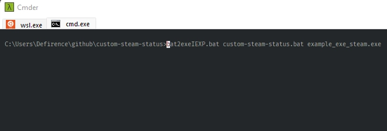
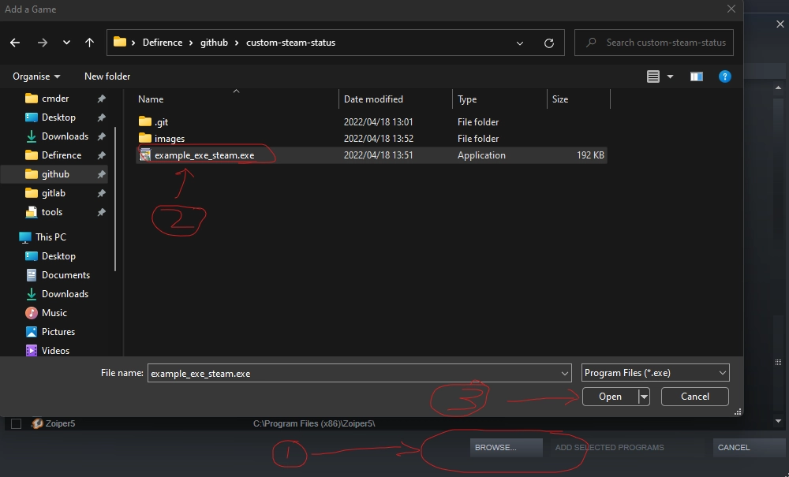
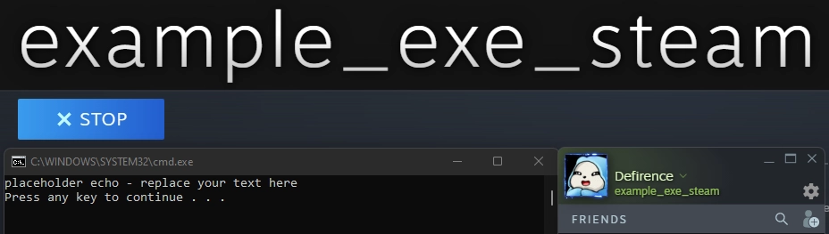

# custom-steam-status

### ***Easy to use "custom status" for Steam***

---
### **Purpose**:

Takes a custom `.bat` file/script which uses the `IEXPRESS` script to compile an exe, which can be added as a non-Steam game to display a "custom status message" so to speak.

### **Requirements**:

Requires zero dependencies or knowledge of Batch scripting although this would help.

DOS, OS/2, MS Windows (3.1 Minimum) or an environment capable of creating, reading, compiling and running `.bat` and `.exe` files. 

#### **N.B: Not tested on anything below Windows 11 Pro 21H2 - Build: 22000.556**

If you're using anything above DOS, Win98, Me, XP, Vista or 7, 8 and 10 this will work too.

Makes use of npocmaka's IEXPRESS script:
https://github.com/npocmaka/batch.scripts/edit/master/hybrids/iexpress/bat2exeIEXP.bat

### **Cloning + Building from Source**:
HTTPS: `git clone https://github.com/Defirence/custom-steam-status.git`

SSH: `git clone git@github.com:Defirence/custom-steam-status.git`

### **Downloading as a Standalone .exe file**:

You can click here to download the `.exe` directly: 

https://github.com/Defirence/custom-steam-status/releases/download/0.1/custom-steam-status-v0_1.exe

### **Usage**:

`bat2exeIEXP.bat custom-steam-status.bat title-shown-on-steam.exe`

The compiled .exe will be stored in the current working directory, the status message displayed on Steam is determined by the name of the .exe file.

You're welcome to also download the pre-compiled .exe file from Releases. Although it's preferable you compile from source for better trust and security since you should never trust pre-compiled .exe files from anywhere, even if the source looks trustworthy.

The reason behind adding the pre-compiled .exe file is to make it easier for people unfamiliar with building from source, scripting, git cloning etc... to use this software. 

I personally would rather not include the pre-compiled .exe, since it discourages learning, but I do understand not everyone is as technically-minded as myself or most others are with software and development.

### **Adding exe file to Steam**:

Navigate to the top menu bar -> `Games` -> `Add a non-steam game to my library`

Find the directory where you stored the compiled or downloaded .exe file and add it.

Once you have located and selected the .exe file, select `"Add selected programs"`.

Click the `"Play"` button to start the program and display the "custom" status message and minimize the `cmd` window that pops up.

### **Caveats**:

No option to minimize this to the notification tray.

Open an Issue or PR to get this added if it's *really* needed, otherwise for now it will be considered for a future version or release.

Can be run while playing VAC-protected games, but completely untested against other clients (EAC, PB etc..)

### **Media Types**:

* application/bat
* application/x-bat
* application/x-msdos-program
* text/plain

##### Adapted from: [Wikipedia - Batch file](https://en.wikipedia.org/wiki/Batch_file)

### **Licences**:
custom-steam-status: No Licence.

npocmaka's IEXPRESS: MIT Licence from original Repository.

### **Screenshots**:

